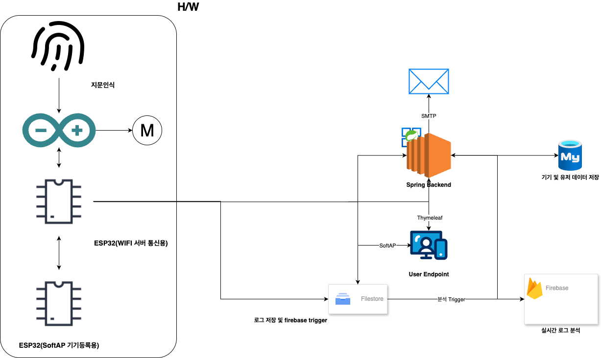

## Architecture

# Fingerprint Door Lock System

지문 인식을 기반으로 한 스마트 도어락 시스템입니다. ESP32와 Spring Boot, Firebase, MQTT, Firestore를 활용하여 보안성과 확장성을 확보했습니다.

---

## ⚙️ 시스템 구성도

- **ESP32 (등록용)**: SoftAP + WebServer + UART 송신
- **ESP32 (서버연결용)**: Wi-Fi STA + UART 수신 → Spring 서버로 MAC 주소, 닉네임, 비밀번호 전송
- **Spring Boot 서버**:
  - Firebase와 연동
  - Firestore Trigger 처리
  - MQTT 통신
  - SMTP 이메일 발송

---

## 📡 MQTT 통신

- **MqttConfig**
  - MQTT 클라이언트 Bean 등록
- **MqttService**
  - 기기별 Topic: `fingerprint/{deviceId}`
  - QoS 1 설정 → 수신 보장
  - 서버 → ESP32 메시지 발행
- **ESP32**
  - 부팅 시 Subscribe
  - 서버에서 메시지 수신 시 동작

---

## 🔥 Firebase / Firestore Trigger

- **로그 저장**: `logs` 컬렉션에 `result`, `deviceId`, `timestamp` 저장
- **Trigger**: 연속 실패 감지
  - `result == "fail"`인 최근 로그 3개 중복 시 Spring 서버에 POST 요청
- **Spring 처리**
  - 위험 감지 시 이메일 전송 (SMTP)
  - 인증 없이 단순 POST (프로토타입)

---

## 📦 주요 기능 요약

| 기능 | 설명 |
|------|------|
| 지문 등록 | ESP32 등록기 → 닉네임, Wi-Fi 정보 전송 |
| 로그 기록 | Firestore에 로그 자동 저장 |
| MQTT 연결 | 서버 ↔ ESP32 실시간 제어 |
| 위험 감지 | 연속 실패 시 이메일 알림 발송 |
| 기기별 구분 | `deviceId` 기준 Topic 및 로그 구분 |

---

## ✅ 기술 스택

- **Frontend**: HTML (ESP32 WebServer)
- **Firmware**: ESP32 (UART, SoftAP, MQTT)
- **Backend**: Spring Boot, Firebase Admin SDK
- **Database**: MySQL (회원정보), Firestore (로그)
- **Messaging**: Eclipse Mosquitto (MQTT Broker)

---

## 🧪 테스트 방법

1. ESP32 등록기 부팅 → SoftAP 접속 → 정보 입력
2. 서버 연결용 ESP32 부팅 (UART 수신 + MQTT 연결)
3. 지문 인식 실패 3회 시 이메일 수신 확인

